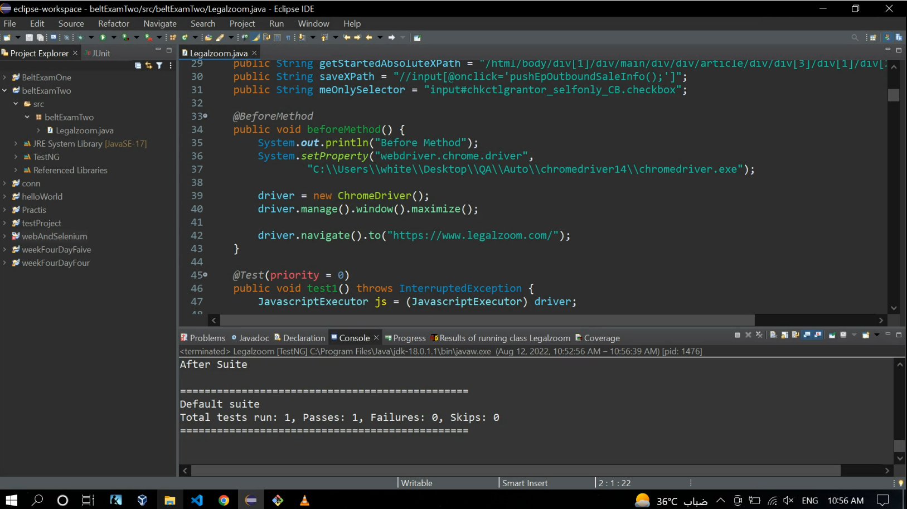
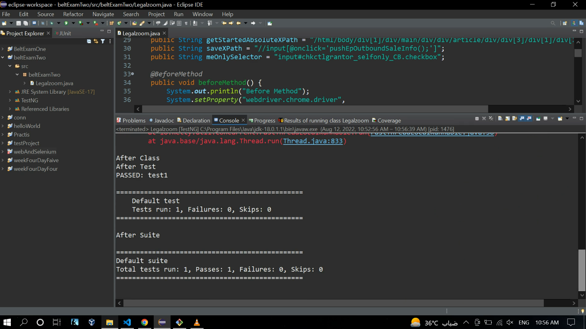
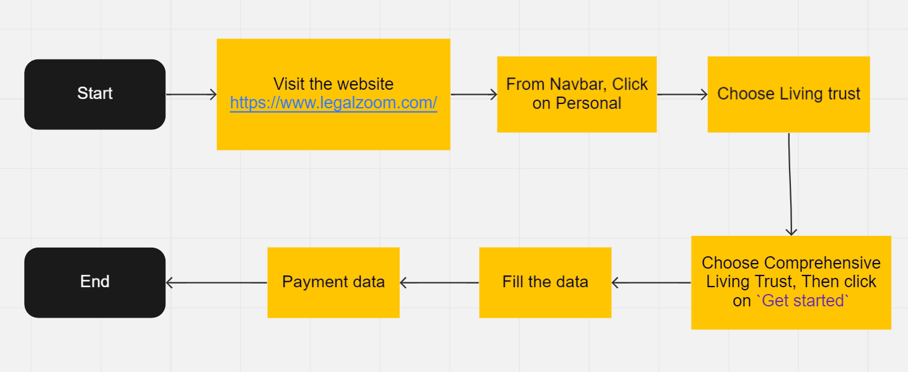

## SoftwareQA Automation Testing-legalzoom Site

* In This Project, I Created an Automation Suite using Java With Selenium (TestNG Framework) for <a href='https://www.legalzoom.com/'>LegalZoom Site</a>, to confirm the error message when a wrong credit card number is entered for living trust Application form in the legal zoom.

### project files
* Test Documents, for the Testing Procedure.
    * <a href="https://docs.google.com/spreadsheets/d/1n9TxkJv8yHQfvUhR3RD3y_Niafmjs0XEcu7t_V8D7t8/edit?usp=sharing">Test Scenarios & Test cases.</a>
    * <c href="#Test Result Report">Test Result Report.</a>
* <a href="#Workflow for LegalZoom website">Workflow for LegalZoom website.</a>
* Recorded video, while Automated testing running
* Source code.

### How to Setup the Environment:
* <a href='https://docs.google.com/document/d/1r0QXGeFffB4Qrr8OxcUTBpUevC5CVmq7oq5MjoIgTwI/edit?usp=sharing'> Eclipse IDE, Java with selenium (TestNg Framework)</a>
* <a href='https://docs.google.com/document/d/16XfJ2DJBeHoDWEAFgU5-OV6G7vo1xvSuMK5HMX9SwlY/edit?usp=sharing'> Selenium WebDriver, Setup Latest Driver for Chrome Driver</a>

### Test Result Report

### Workflow for LegalZoom website

