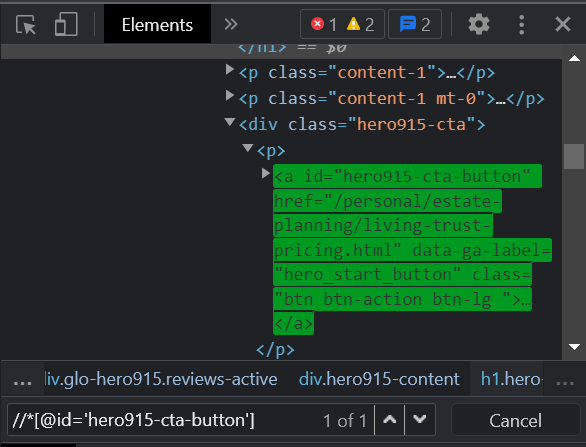
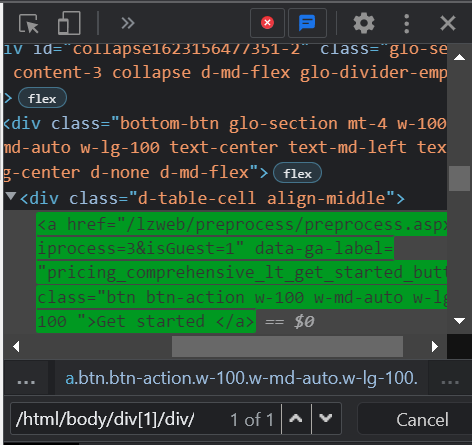
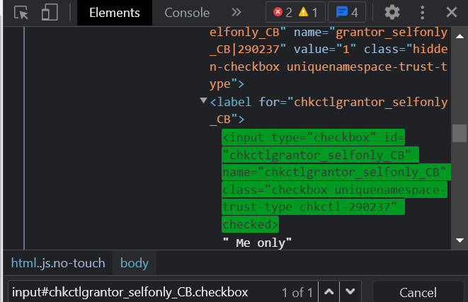

## Selenium Locators

### personalSelector

### livingTrustXPath

### startButtonXPath

### getStartedAbsoluteXPath

### saveXPath

### meOnlySelector

### `div.textboxStandard>div>input`

### `<select> ... </select>`

### `input.textbox`

### `label>input`

### `input.textbox`

### `pow_MC`

### `input[id*='ctl00_cphMainContent_txt']`
